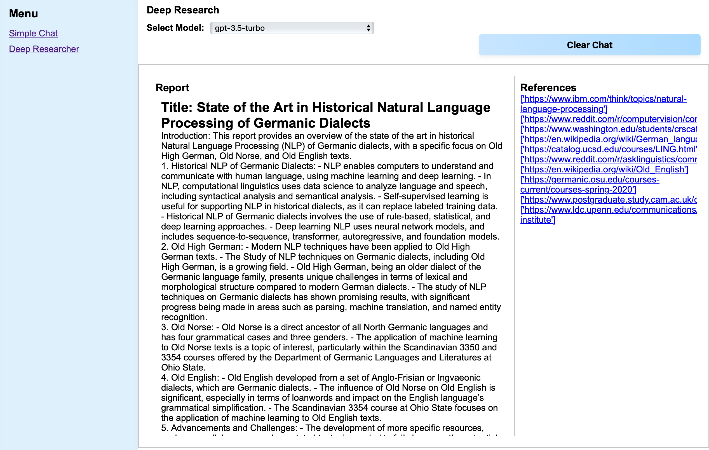
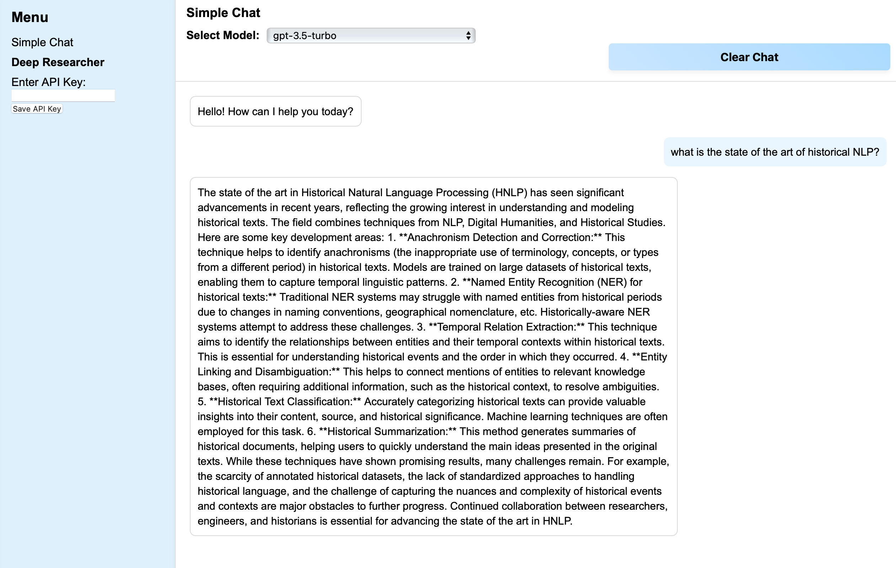

**Disclaimer**: This implementation is solely done for fun and is not intended to be a competitive or productive implementation alternatives for Hugging Face or OpenAI Deep Researchers.

A good amount of code was reworked from these notebooks, integrated with Flask and other search options: 
https://github.com/mshumer/OpenDeepResearcher

# LLM Deep Researcher



Deep Researcher imitates the OpenAI deep researcher by searching and sending search results to LLM.
It is important to set up the .env file.

### API Keys

- **SerpAPI**: You can get your SerpAPI key from [SerpAPI](https://serpapi.com/).
- **Jina**: You can get your Jina key from [Jina AI](https://jina.ai/).
- **Google Custom Search**: You can get your Google Custom Search key from [Google Custom Search](https://developers.google.com/custom-search/v1/overview).

### Fallback Mechanism

As SerpAPI and Jina run out of credits quite quickly, the application has a fallback mechanism:
1. **SerpAPI**: Primary search API.
2. **Jina**: Primary web scraping API.
3. **Google Custom Search**: Secondary search API.
4. **Beautiful Soup**: Third option when all the credits ran out: DIY search and web scraping tool.

# LLM API Frontend / Simple Chat

This project is a Flask application with separated frontend and backend (API) blueprints.



## Installation

To set up the project, follow these steps:

### Prerequisites

- Python 3.11 or higher
- Poetry (for dependency management)

### Step 1: Clone the repository
```
curl -sSL https://install.python-poetry.org | python3 -m https://github.com/mariasukhareva/llm-api-frontend.git
```
### Step 2: Install dependencies

Navigate to the project directory and install the dependencies using Poetry:

```sh
cd llm-api-frontend
poetry install
```

### Step 3: Set up environment variables

Create a `.env` file in the project root and add the necessary environment variables:

in frontend-for-llm-api/app/frontend/.env
```
touch frontend-for-llm-api/app/frontend/.env
```
add your api key in the env files:

```
LLM_API_KEY="YOUR_API_KEY"
```
You can also add your API key in the frontend
You can get the API key here

https://my.siemens.com/

### Step 4: Run the application

```
python run.py
```

## Usage

Once the application is running, you can access it at `http://127.0.0.1:5000/`.

## Frontend

if everything is configure correctly, you should be able to see the list of models from LLM api in the drop down box

If for some reason you do not see it, try to reload the page first. 

If reloading did not help, try to restart the python script:

```
python run.py
```
### Deep Search Tab

If you clear the Deep Search tab, you should see a different window. Note that it does not allow multi-turn dialogues for now, so each query will trigger a new deep search.


## Configure API Key through frontend

You can also add your API key in the frontend from OpenAI or any compatible API


## Testing

To run the tests, use the following command:

```sh
poetry run pytest
```
