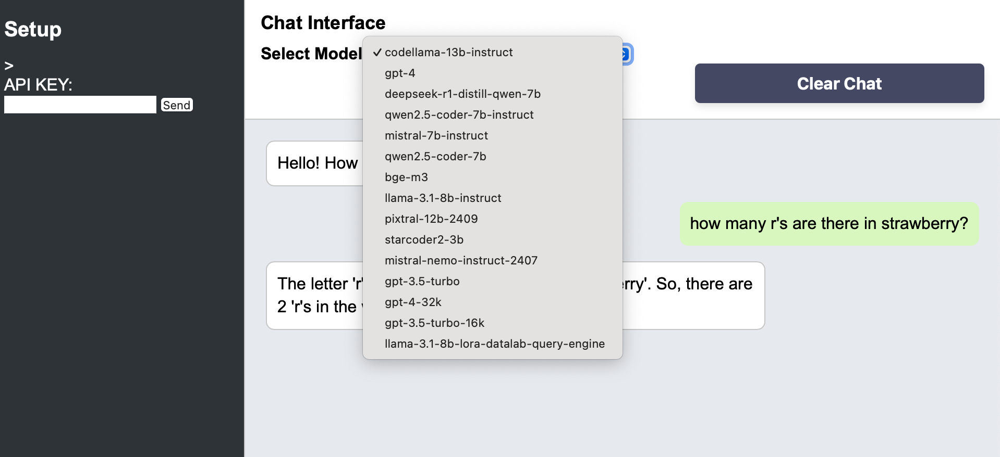

# LLM Deep Researcher


Deep Researcher immitated the OpenAI deep researcher by search and sending search results to LLM.
It is important to setup the .env.
The jina is not a must as well as serpAPI.
Once jina and serpAPI run out it will switch to Google Custom Search, ones google custom search runs out it will switch to Beautiful Soup.

It should work with all the LLMs from the LLM Api


# LLM API Frontend / Simple Chat

This project is a Flask application with separated frontend and backend (API) blueprints.


## Installation


To set up the project, follow these steps:

### Prerequisites

- Python 3.11 or higher
- Poetry (for dependency management)

### Step 1: Clone the repository


```
curl -sSL https://install.python-poetry.org | python3 -m https://github.com/mariasukhareva/llm-api-frontend.git
```
### Step 2: Install dependencies

Navigate to the project directory and install the dependencies using Poetry:

```sh
cd llm-api-frontend
poetry install
```

### Step 3: Set up environment variables

Create a `.env` file in the project root and add the necessary environment variables:

in frontend-for-llm-api/app/frontend/.env
```
touch frontend-for-llm-api/app/frontend/.env
```
add your api key in the env files:

```
LLM_API_KEY="YOUR_API_KEY"
```
You can also add your API key in the frontend
You can get the API key here

https://my.siemens.com/

### Step 4: Run the application

```
python run.py
```

## Usage

Once the application is running, you can access it at `http://127.0.0.1:5000/`.

## Frontend

if everything is configure correctly, you should be able to see the list of models from LLM api in the drop down box


If for some reason you do not see it, try to reload the page first. 

If reloading did not help, try to restart the python script:

```
python run.py
```

## Configure API Key through frontend

You can also add your API key in the frontend
You can get the API key here

https://my.siemens.com/

The further documentation is here:

https://code.siemens.io/ai/#large-language-model-llm-api-usage

## Testing

To run the tests, use the following command:

```sh
poetry run pytest
```
